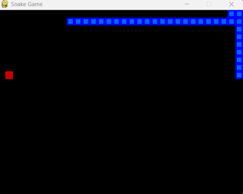

# Snake AI with Deep Q-Learning
A reinforcement learning agent that learns to play Snake using a Deep Q-Network (DQN).



## Features
- Custom Snake game built with **Pygame**
- Deep Q-Network implemented with **PyTorch**
- Learns using **short-term and long-term memory**
- Plots scores and performance over time

## Installation
1. Clone the repository:
```bash
git clone https://github.com/NesrineTahmi/snake-game-RL.git
cd snake-game-RL
```
2. Install dependencies:
```bash
pip install -r requirements.txt
```
## Usage
To train an agent : 
```bash
python agent.py
```
The best model will be saved automatically to /model .

## Project structure 
agent.py → AI agent that plays the game

model.py → Neural network and trainer

snake_game.py → Pygame Snake game

helper.py → Utilities for plotting scores

plots/ → Training plots

model/ → Saved models

## Lisence
MIT License
